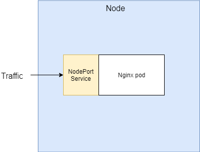
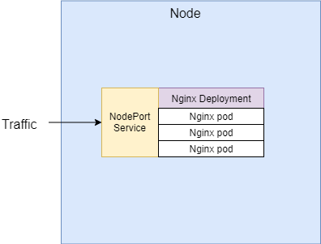
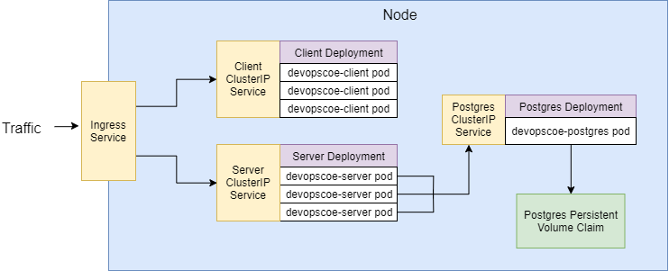

# DevOps CoE: Kubernetes

## simple-k8s
Contains Kubernetes configuration files for setting up an Nginx container using a pod or a set of containers using a deployment with NodePort service.

### Usage with pod
*kubectl apply -f simple-k8s/nginx-pod.yaml* 
*kubectl apply -f simple-k8s/nginx-node-port.yaml*

### Usage with deployment
*kubectl apply -f simple-k8s/nginx-deployment.yaml* 
*kubectl apply -f simple-k8s/nginx-node-port.yaml*

## complex-k8s

*application architecture*

__k8s:__
Contains Kubernetes configuration files for setting up the application.

__client:__
Contains source code and Dockerfile for building the front-end image. (React, Nginx)

__server:__
Contains source code and Dockerfile for building the back-end image. (Node.js, Express)

__database:__
Contains Dockerfile for creating a database image with initial data. (Postgres)

### Usage
All the Docker images needed for the application are already pre-built and found in Dockerhub. No need to build anything in order to run this demo. Of course you are free to fork, clone or download the repository and make your own experiments by modifying the files. Then just build your own images using the Dockerfiles, push them to your Docker registry and change image names in k8s deployment files.

NOTE: Before deploying anything for the first time, you will need to:

1. define a secret for Postgres password with command:

*kubectl create secret generic pgpassword --from-literal PGPASSWORD=<replace_with_your_secret_password>*

2. Install Nginx Ingress Controller: https://kubernetes.github.io/ingress-nginx/deploy/

Then everything should work when you apply configuration files with:

*kubectl apply -f complex-k8s/k8s*
